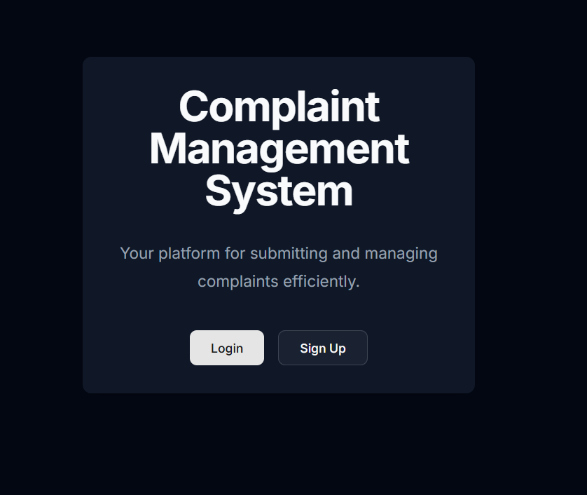
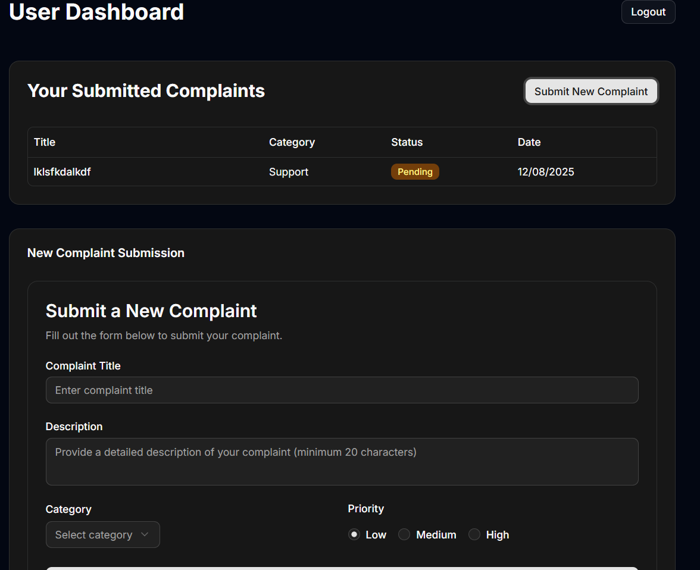
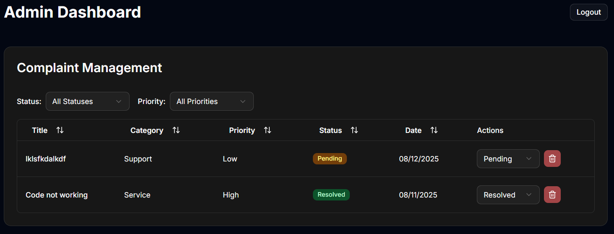
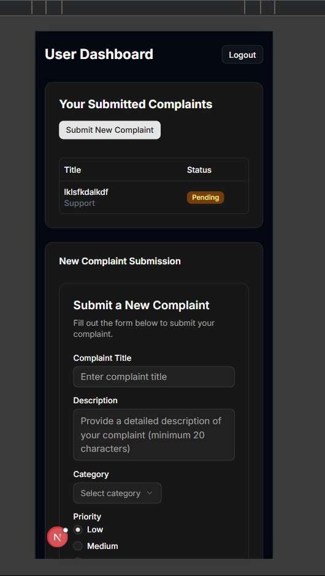

# Complaint Management System

A full-stack web application built with **Next.js 15**, **TypeScript**, **MongoDB**, and **Nodemailer** for managing customer complaints with dedicated user and admin interfaces.

## ✨ Features

- **User Authentication** – Secure login/signup with email verification via OTP.
- **Role-Based Access** – Separate dashboards for users and administrators.
- **Complaint Management** – Users can submit complaints; admins can update statuses and manage records.
- **Email Notifications** – Automated email alerts for complaint submissions and status changes.
- **Responsive Design** – Fully functional across desktop and mobile devices.
- **Real-Time Updates** – Instant status changes with live email notifications.

## 🛠 Tech Stack

- **Frontend:** Next.js 15 (App Router), React 18, TypeScript
- **Styling:** Tailwind CSS, Radix UI Components
- **Backend:** Next.js API Routes, Server Actions
- **Database:** MongoDB with Mongoose ODM
- **Authentication:** JWT tokens with secure cookie storage
- **Email Service:** Nodemailer (Gmail SMTP or any SMTP provider)
- **Validation:** Zod schema validation

## 📋 Prerequisites

Before running this application, ensure you have:

- **Node.js 18+** installed
- A **MongoDB** database (local or cloud instance)
- A **Gmail account** or other SMTP service for sending email notifications


## 🚀 Installation

1. **Clone the repository**
   ```bash
   git clone <repository-url>
   cd complaint-management-app


2. **Install dependencies**
   ```bash
   npm install
   # or
   yarn install
   ```

3. **Set up environment variables**
   
   Create a `.env.local` file in the root directory:

   ```env
   # Database Configuration
   MONGODB_URI=mongodb://localhost:27017/complaint-management
   # For MongoDB Atlas:
   # MONGODB_URI=mongodb+srv://<username>:<password>@cluster.mongodb.net/complaint-management

   # JWT Secret (use a secure, random string)
   JWT_SECRET=your-super-secure-jwt-secret-key

   # Email Configuration (Gmail SMTP or any SMTP provider)
   EMAIL_USER=your-email@gmail.com
   EMAIL_PASS=your-app-password

   # Base URL (change for production)
   NEXT_PUBLIC_BASE_URL=http://localhost:3000
   ```

## 🗄 MongoDB Setup

### **Option 1: Local MongoDB**
1. Install MongoDB locally from the [official website](https://www.mongodb.com/try/download/community).
2. Start the MongoDB service.
3. Use the connection string in your `.env.local` file:
   ```env
   MONGODB_URI=mongodb://localhost:27017/complaint-management

### Option 2: MongoDB Atlas (Cloud)
1. Create an account at [MongoDB Atlas](https://www.mongodb.com/atlas).
2. Create a new cluster.
3. From your cluster dashboard, click **Connect → Connect your application**.
4. Copy the provided connection string and replace:
   - `<username>` with your MongoDB username
   - `<password>` with your MongoDB password
   - `<cluster-url>` with your cluster's host URL

## Email Configuration

### 📧 Gmail Setup (Recommended)
1. **Enable 2-Step Verification** on your Google account.
2. **Generate an App Password**:
   - Go to **Google Account Settings → Security**.
   - Under **"How you sign in to Google"**, select **App passwords**.
   - Choose **"Mail"** as the app and **"Other (Custom name)"** for the device.
   - Click **Generate** and copy the 16-character password.

3. **Update environment variables**  
   Add the following to your `.env.local` file:
   ```env
   EMAIL_USER=your-email@gmail.com
   EMAIL_PASS=your-16-character-app-password


### 📧 Other Email Services
To use a different SMTP provider, update the transporter configuration in `lib/email.ts`:

```javascript
const transporter = nodemailer.createTransport({
  host: 'smtp.your-provider.com',
  port: 587, // Use 465 for secure connections
  secure: false, // Set to true if using port 465
  auth: {
    user: process.env.EMAIL_USER,
    pass: process.env.EMAIL_PASS
  }
});


## 🚀 Running the Application

1. **Development Mode**
   ```bash
   npm run dev
   # or
   yarn dev
   ```
   
   The application will be available at [http://localhost:3000](http://localhost:3000)
2. **Production Build**
   ```bash
   npm run build
   npm start
   # or
   yarn build
   yarn start
   ```

## 📖 Usage Guide

### For Users
1. **Registration**  
   Sign up using your email and password.

2. **Email Verification**  
   Verify your account by entering the OTP sent to your email.

3. **Submit Complaints**  
   Fill out the complaint form with details including title, description, category, and priority.

4. **Track Status**  
   Monitor the status of your submitted complaints through your dashboard.

5. **Email Updates**  
   Receive email notifications whenever the status of your complaints changes.

### For Administrators
1. **Admin Access**  
   Log in using your administrator credentials.

2. **View All Complaints**  
   Access all user complaints with filtering and sorting options.

3. **Update Status**  
   Change the status of complaints (e.g., Pending → In Progress → Resolved).

4. **Delete Complaints**  
   Remove complaints when necessary.

5. **Email Notifications**  
   Receive alerts for new complaints and send status updates to users.


## 📌 API Endpoints

### 📝 Complaints
| Method     | Endpoint                      | Description                                | Access              |
|------------|-------------------------------|--------------------------------------------|---------------------|
| **POST**   | `/api/complaints`             | Create a new complaint                     | Authenticated users |
| **GET**    | `/api/complaints`             | Retrieve complaints (filtered by user role)| Authenticated users |
| **PATCH**  | `/api/complaints/[id]`        | Update complaint status                    | Admin only          |
| **DELETE** | `/api/complaints/[id]`        | Delete a complaint                         | Admin only          |

---

## Project Structure

```

complaint-management-app/
├── app/                          # Next.js App Router
│   ├── admin/dashboard/          # Admin dashboard page
│   ├── user/dashboard/           # User dashboard page
│   ├── api/complaints/           # API routes
│   ├── login/                    # Login page
│   ├── signup/                   # Signup page
│   └── verify-email/             # Email verification page
├── components/                   # Reusable React components
│   ├── complaint-form.tsx        # Complaint submission form
│   ├── complaint-table.tsx       # Admin complaint management table
│   └── auth-form.tsx             # Authentication forms
├── lib/                          # Utility functions and configurations
│   ├── models/                   # MongoDB schemas
│   ├── auth.ts                   # Authentication utilities
│   ├── db.ts                     # Database connection
│   └── email.ts                  # Email service configuration
└── actions/                      # Server actions
    ├── auth.ts                   # Authentication actions
    └── complaints.ts             # Complaint management actions

```
---

## Screenshots

### Landing Page

*Clean and professional landing page with login/signup options*

### User Dashboard

*User-friendly dashboard showing personal complaints and submission form*

### Admin Dashboard

*Comprehensive admin interface with filtering and management capabilities*

### Mobile Responsive

*Fully responsive design optimized for mobile devices*

---

## 🚀 Deployment

### Vercel (Recommended)
1. Push your code to the GitHub repository.
2. Connect the repository to your Vercel account.
3. Add the required environment variables in the Vercel dashboard.
4. Vercel will automatically build and deploy your application.


### Other Platforms
- Ensure the platform supports **Node.js 18+**.
- Set all required environment variables.
- Run `npm run build` before deploying the application.

## ⚙️ Environment Variables

```env
MONGODB_URI=
JWT_SECRET=
EMAIL_USER=
EMAIL_PASS=
```

---

## 🛠 Troubleshooting

### Common Issues

1. **Email Not Sending**
   - Verify that the Gmail app password is correct.
   - Check your spam or junk folder.
   - Ensure 2-Step Verification is enabled on your Google account.


2. **Database connection failed**
   - Verify MongoDB is running (local) or connection string is correct (Atlas)
   - Check network connectivity and firewall settings

3. **Authentication issues**
   - Ensure JWT_SECRET is set and consistent
   - Clear browser cookies and try again

4. **Build errors**
   - Run `npm run lint` to check for code issues
   - Ensure all environment variables are set

---

## 🤝 Contributing

1. Fork the repository.
2. Create a feature branch:
   ```bash
   git checkout -b feature/amazing-feature
   ```
3. Commit your changes:
   ```bash
   git commit -m "Add amazing feature"
   ```
4. Push to your branch:
   ```bash
   git push origin feature/amazing-feature
   ```
5. Open a Pull Request

---

## 👤 Author

**OmXDev**  
🔗 [GitHub Profile](https://github.com/OmXDev)

---

## 📄 License

MIT – feel free to use, modify, and build upon this project.

**Built with ❤️ using Next.js, TypeScript, and MongoDB**
